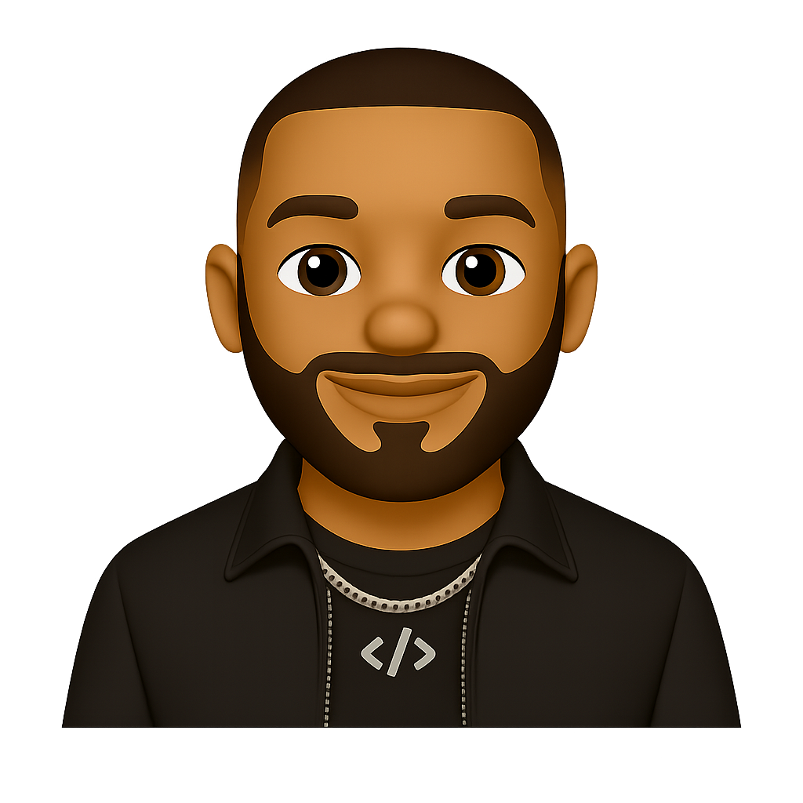

<br>

<p align='center'>

</p>

<p align='center'>

</p>

<!--- ## Hi there , I'm Myron

I'm a **Software Engineer** who's passionate about creating meaningful digital experiences and solving real-worls problems through code.
-->
 
<p align="center">
  <a href="mailto:mossjmyron@gmail.com"></a>
  <a href="https://www.linkedin.com/in/mossjmyron/"></a>
</p>

```yaml
name: Myron Moss
current_role: Software Engineer
technical_background:
  [
    "Software Engineer",
    "Software Developer",
    "DevOps/Release Engineer",
    "Release Coordinator",
  ]
education:
  [
    "Bachelor's in Computer Science",
    "Associate's in Information Technology"
  ]
miltary_service: {
   branch: Army National Guard,
   rank: Captain,
   MOS: 31A
 }
```

```python
dev = Developer("Myron")

while dev.isCoding():
    dev.listen_to_music()
    dev.open_ai_tool()
    dev.drink_water()
```

<table align="center">
  <tr>
    <td align="center" width="72">
      
      <br>Next.js
    </td>
    <td align="center" width="72">
      
      <br>React
    </td>
    <td align="center" width="72">
      
      <br>TypeScript
    </td>
    <td align="center" width="72">
      
      <br>JavaScript
    </td>
    <td align="center" width="72">
      
      <br>Tailwind
    </td>
  </tr>
  <tr>
    <td align="center" width="72">
      
      <br>Python
    </td>
    <td align="center" width="72">
      
      <br>FastAPI
    </td>
    <td align="center" width="72">
      
      <br>Firebase
    </td>
    <td align="center" width="72">
      
      <br>PostgreSQL
    </td>
    <td align="center" width="72">
      
      <br>Git
    </td>
  </tr>
</table>

##

<p align="center">
  
  
  
  <br>
</p>
